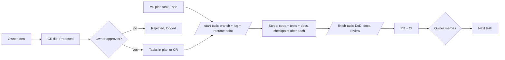

# Workflow — overview, Definition of Ready/Done, task report

## The lifecycle



Roles:
- **Owner:** decides what gets built, approves plans, CRs and PRs, merges, and does [MANUAL] steps.
- **AI coder:** builds through the session protocol (`16`).
- **Reviewer:** a fresh-context subagent or session that checks the work.
- **CI:** the final mechanical gate.

## Who reads what
- Session protocol: `16`.
- What needs approval: `15`.
- Docs rules: `17`.
- Code rules: `14`.
- Where code goes and which docs to touch: `19`.
- Git and CI: `18`.

## Owner's side of one task
1. Start a session in the repo (Claude Code: `claude`; other tools: open the folder).
2. Claude Code: `/clear`, then `/model` (Opus 5.5 for `[O]`, Sonnet 5.5 for `[S]`), then `/start-task M0-15`.
   Other tools: "Read AGENTS.md, then start task M0-15 following core-instructions/16-session-protocol.md."
3. For `[PLAN]` tasks, review the plan and approve it, or redirect.
4. Answer questions, and do [MANUAL] steps when asked.
5. Read the task report, review the PR on GitHub, and squash-merge when satisfied.
6. If the session ended early (tokens ran out), start a new session (any tool) and run `/resume`, or say "resume".

## Definition of Ready (before coding starts)
- The task has an id, a clear goal and testable acceptance criteria (in the plan or an approved CR).
- Its dependencies are `Done`, `main` is green, and the docs it names exist.
- Open design questions are answered by the owner and recorded.

## Definition of Done (every task)
- [ ] Acceptance criteria met; nothing outside the task's scope changed (or approved and logged).
- [ ] Build passes with zero warnings in `src/`, and `dotnet format --verify-no-changes` passes.
- [ ] New behaviour has tests; relevant suites pass; no test was weakened (or G-Tests was approved).
- [ ] No game-number literals, no client authority, no era- or research-specific `if`s, no XP or level concepts.
- [ ] Docs updated per the change recipe (`19`); public APIs have XML docs; touched module docs show `Last updated: <ID>`.
- [ ] `scripts/dev/check-docs.sh --base origin/main` passes; generated docs are current (from M0-61).
- [ ] Build log entry complete: sessions, every decision, owner input, verification, follow-ups.
- [ ] Resume point `IDLE`, plan board row updated, `CHANGELOG` line added, decision rows and ADRs added if needed.
- [ ] Reviewer pass done for `[O]` tasks, with blocking findings fixed.
- [ ] Branch pushed, PR opened with the template filled, and the report given to the owner.

## Task report format (the final message of every task)
```
## Summary            — what changed, in 2–4 lines
## Acceptance criteria — each one: met / not met (why)
## Files changed      — grouped by area
## Tests              — added/changed; commands run; pass/fail counts before → after
## Not verified       — anything you could not run, and why
## Decisions          — count + the important ones (full list in the build log entry)
## Docs updated       — list
## Known limitations  — honest list
## PR                 — link; anything the owner must do (merge, [MANUAL] steps)
## Next task          — id and title
```

## Model guidance
- **Opus 5.5 `[O]`:** simulation engine, transactions/concurrency, idempotency, security, architecture, reviews,
  debugging non-obvious failures, CR impact analysis.
- **Sonnet 5.5 `[S]`:** scaffolding, DTOs, UI Toolkit screens, logging, docs, straightforward tests.
- If a Sonnet task fails twice on the same problem, switch to Opus rather than retrying a third time.

## Instruction hygiene
- Always-loaded files stay small: `AGENTS.md` ≤ 150, `CLAUDE.md` ≤ 80, `02` ≤ 70, `13` ≤ 80 lines (check-docs enforces this).
- Run `/doctor prompt-audit` (Claude Code) after editing instruction files, to catch contradictions.
- When an instruction keeps being ignored, make it shorter and more specific, or enforce it with a hook or check.
- **When the owner changes the design:** if a task conflicts with `21`–`26`, follow those files, say so in the report,
  and log a decision. The pillars in `22` override everything else in design.
