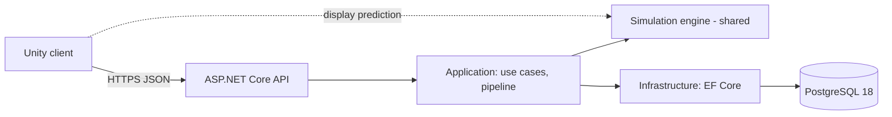

# Architecture Overview (as built)

> *Not built yet.* This page describes the system **as it exists**. M0-06 writes the first real version, and M0-63
> completes it. Until then, the intended architecture is `core-instructions/03-architecture.md`.

## System

## Projects and assemblies
*(planned)* A table of every project and assembly, its references, and a link to its module doc in `docs/modules/`.

## Request lifecycle
*(planned)* A sequence diagram of one command, from tap to snapshot, as implemented.

Last updated: KIT
